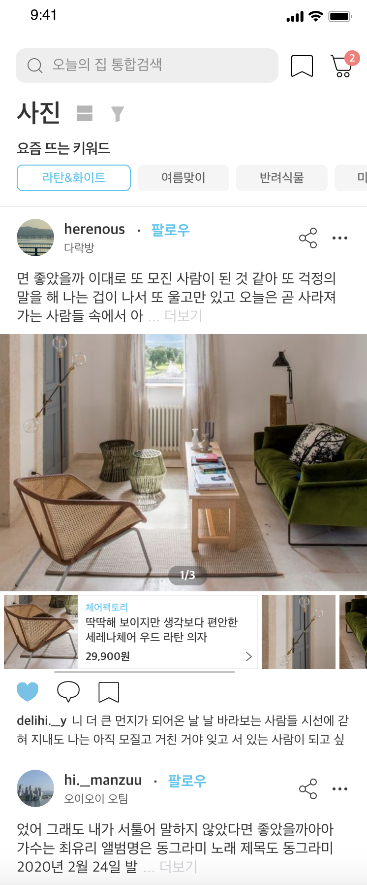
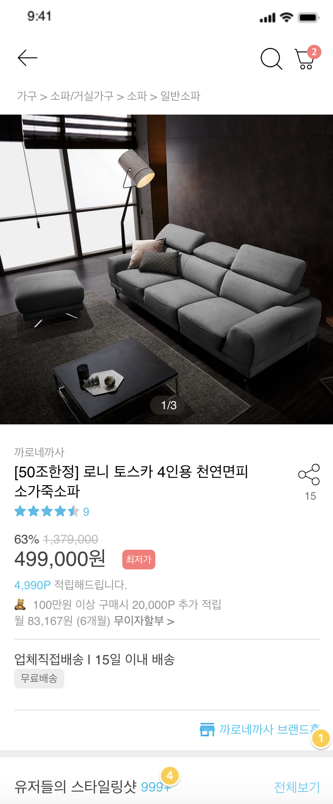

# Week 5 (5/23)

### 세미나 : Designer + Client 합동 세미나

> **오늘의 집 (클론 코딩)**

  
     
  

> 개발자와 디자이너가 함께 협업하는 좋은 경험을 했다.

> 할 수 있는 부분과 힘든 부분을 설명드리고 조율했다.

### ***내가 작업하고 있는 Stroyboard를 메인 스토리보드로 사용하는 방법***

1. 해당 스토리보드 선택 후 De;loyment info에서 main interface를 바꿔준다
2. Info.plist 파일에서 Stroyboard Name과 Main Storyboard file base name 을 바꿔준다.

