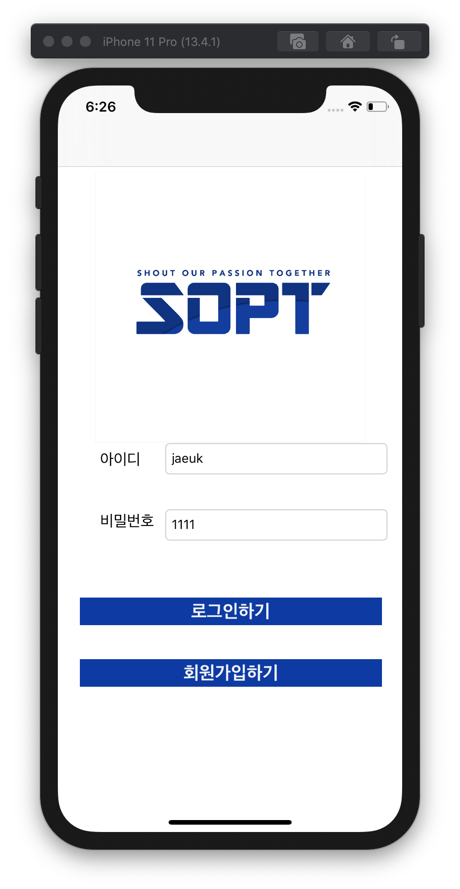
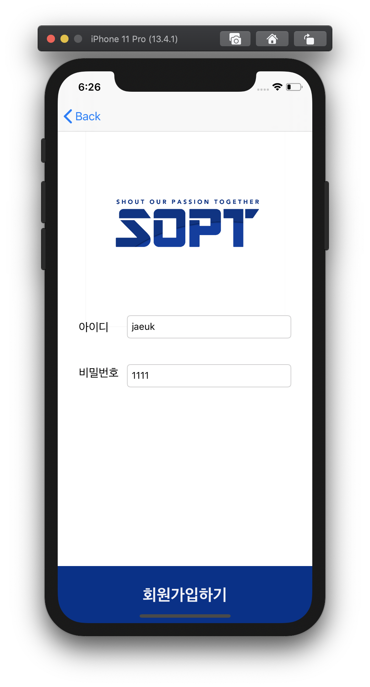
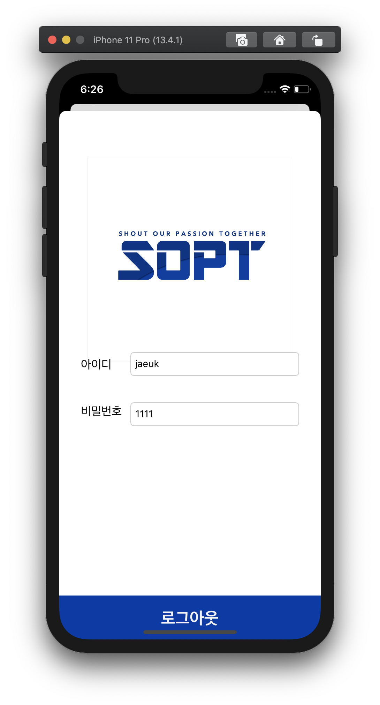

### 1차 과제 01

#### navigation 이용 화면이동

기한: ~2020.04.24(금)

review

- navigation을 이용하면 차곡차곡 vc를 쌓아가는 과정을 통해 아이폰 설정화면 처럼 한 화면씩 뒤로가기 할 수 있다.

### 1차 과제 02   

#### 로그인 화면 구현

기한: ~2020.04.24(금)

 
 
 

<pre>
<code>
class ViewController: UIViewController {

    @IBOutlet weak var imageView: UIImageView!
    @IBOutlet var idTextField: UITextField!
    @IBOutlet var pwTextField: UITextField!
    
    override func viewDidLoad() {
        super.viewDidLoad()
        // Do any additional setup after loading the view.
        // 이미지뷰에 이미지 넣기
        imageView.image = UIImage(named: "sopt.png")
    }
    
    @IBAction func transferData(_ sender: Any) {
        
        // 데이터 전달하기
        guard let receiveViewController = self.storyboard?.instantiateViewController(identifier: "loginViewController") as? LogInViewController else {return}
        
        receiveViewController.id = idTextField.text
        receiveViewController.pw = pwTextField.text
        // vc present
        self.present(receiveViewController, animated: true, completion: nil)
    }

}
</code>
</pre>

review

- navigation을 이용해 하나의 vc 간 present는 가능하지만 leafvc 부터 rootvc 까지 dismiss 하는 방법을 모르겠다.
- UIButton을 vc 하단에 배치했으나 present modally를 하면 버튼이 사라지거나 상단으로 이상하게 배치되는 문제가 있다.
- imageView를 모든 View에서 일정한 위치에 놓고싶다.

