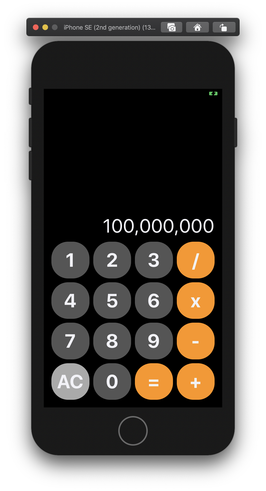
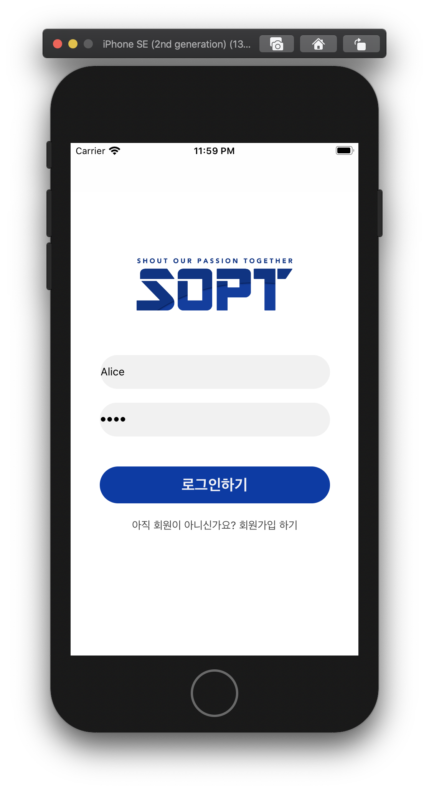
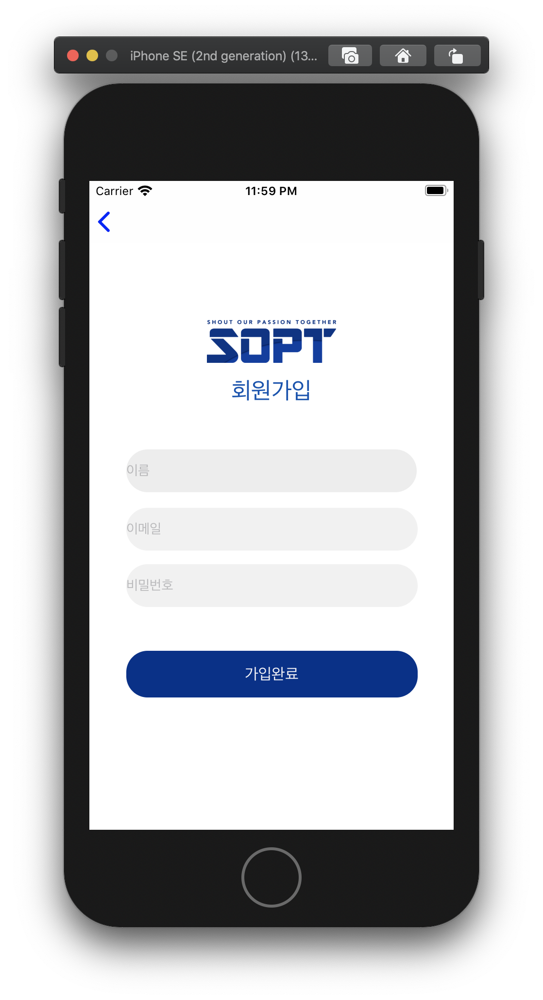
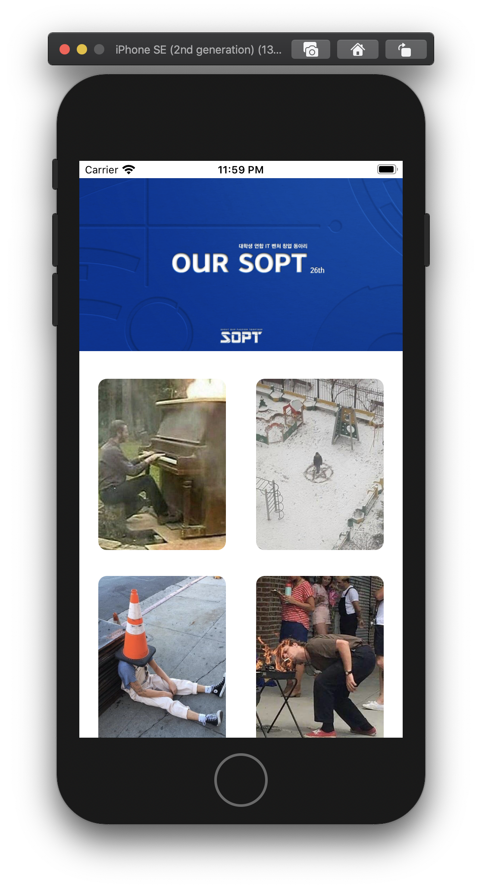
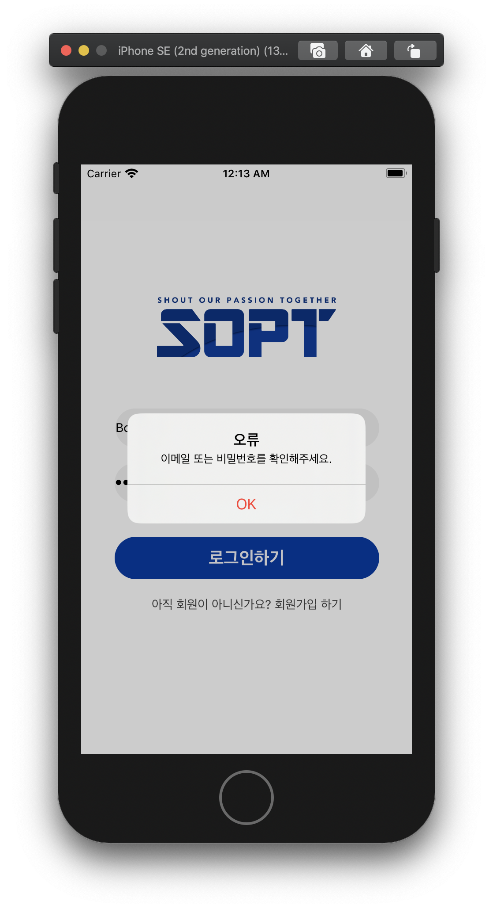

# Yang Jaeuk
양재욱

안녕하세요

iOS파트 YB입니다.

# 과제 업로드 레포

## 목차

+ 1차 과제 : 1-1) 네비게이션을 이용한 화면 이동 | 1-2) vc간 이동 및 데이터 전달
+ 2차 과제 : 2-1) 계산기 | 2-2) Zeplin을 활용해 AutoLayout 잡기
+ 3차 과제 :
+ 4차 과제 :
+ 5차 과제 :
+ 6차 과제 :
+ 7차 과제 :

### 1차 과제 01

#### navigation 이용 화면이동

기한: ~2020.04.24(금)

review

- navigation을 이용하면 차곡차곡 vc를 쌓아가는 과정을 통해 아이폰 설정화면 처럼 한 화면씩 뒤로가기 할 수 있다.

### 1차 과제 02   

#### 로그인 화면 구현

기한: ~2020.04.24(금)

 
 
 

<pre>
<code>
class ViewController: UIViewController {

    @IBOutlet weak var imageView: UIImageView!
    @IBOutlet var idTextField: UITextField!
    @IBOutlet var pwTextField: UITextField!
    
    override func viewDidLoad() {
        super.viewDidLoad()
        // Do any additional setup after loading the view.
        // 이미지뷰에 이미지 넣기
        imageView.image = UIImage(named: "sopt.png")
    }
    
    @IBAction func transferData(_ sender: Any) {
        
        // 데이터 전달하기
        guard let receiveViewController = self.storyboard?.instantiateViewController(identifier: "loginViewController") as? LogInViewController else {return}
        
        receiveViewController.id = idTextField.text
        receiveViewController.pw = pwTextField.text
        // vc present
        self.present(receiveViewController, animated: true, completion: nil)
    }

}
</code>
</pre>

review

- navigation을 이용해 하나의 vc 간 present는 가능하지만 leafvc 부터 rootvc 까지 dismiss 하는 방법을 모르겠다.
- UIButton을 vc 하단에 배치했으나 present modally를 하면 버튼이 사라지거나 상단으로 이상하게 배치되는 문제가 있다.
- imageView를 모든 View에서 일정한 위치에 놓고싶다.

### 2차 과제 01

#### 계산기

기한 ~05.08, 2020

  

''' swift

**import** UIKit

**class** ViewController: UIViewController {

  **@IBOutlet** **var** btnOne: UIButton!

  **@IBOutlet** **var** btnTwo: UIButton!

  **@IBOutlet** **var** btnThree: UIButton!

  **@IBOutlet** **var** btnDev: UIButton!

  **@IBOutlet** **var** btnFour: UIButton!

  **@IBOutlet** **var** btnFive: UIButton!

  **@IBOutlet** **var** btnSix: UIButton!

  **@IBOutlet** **var** btnMul: UIButton!

  **@IBOutlet** **var** btnSeven: UIButton!

  **@IBOutlet** **var** btnEight: UIButton!

  **@IBOutlet** **var** btnNine: UIButton!

  **@IBOutlet** **var** btnSub: UIButton!

  **@IBOutlet** **var** btnAC: UIButton!

  **@IBOutlet** **var** btnZero: UIButton!

  **@IBOutlet** **var** btnResult: UIButton!

  **@IBOutlet** **var** btnPlus: UIButton!

   

  

  **override** **func** viewDidLoad() {

​    **super**.viewDidLoad()

​     

​    btnOne.layer.cornerRadius = 35

​    btnTwo.layer.cornerRadius = 35

​    btnThree.layer.cornerRadius = 35

​    btnDev.layer.cornerRadius = 35

​    btnFour.layer.cornerRadius = 35

​    btnFive.layer.cornerRadius = 35

​    btnSix.layer.cornerRadius = 35

​    btnMul.layer.cornerRadius = 35

​    btnSeven.layer.cornerRadius = 35

​    btnEight.layer.cornerRadius = 35

​    btnNine.layer.cornerRadius = 35

​    btnSub.layer.cornerRadius = 35

​    btnAC.layer.cornerRadius = 35

​    btnZero.layer.cornerRadius = 35

​    btnResult.layer.cornerRadius = 35

​    btnPlus.layer.cornerRadius = 35

​     

  }

}

'''

### 2차 과제 02

####  Zeplin + AutoLayout

> 기한 ~05.08, 2020
>
> https://github.com/26th-SOPT-iOS/KimNamSoo
>
> 모르는 부분은 남수형 깃허브를 참고해서 만들었다.

  
  
  
  

> UserModel Class를 생성해 login 을 구현했다.

> UserModel.swift

<pre>
  <code>
  // Created by 양재욱 on 2020/05/05.

// Copyright © 2020 양재욱. All rights reserved.

**import** Foundation

**final** **class** UserModel {

  **struct** User {

​    **var** username: String

​    **var** password: String

  }

   

  **var** model: [User] = [

​    User(username: "Alice", password: "1234"),

​    User(username: "Bob", password: "5678"),

​    User(username: "Charlie", password: "0101")

  ]

   

  // hasUser 검사 method

  **func** hasUser(name: String, pwd: String) -> Bool {

​    **var** result = **false**

​    **for** user **in** model {

​      **if** user.username == name && user.password == pwd {

​        result = **true**

​      }

​    }

​    **return** result

  }

​     

  // newUser 추가 method

  **func** addUser(name: String, pwd: String) {

​    **let** newUser = User(username: name, password: pwd)

​    model.append(newUser)

  }

}
  </code>
</pre>

> Login Button Action

<pre>
  <code>
  

**@IBAction** **func** loginAction(**_** sender: **Any**) {

​    **let** alert = UIAlertController(title: "오류", message: "이메일 또는 비밀번호를 확인해주세요.", preferredStyle: UIAlertController.Style.alert)

​    **let** defaultAction = UIAlertAction(title: "OK", style: .destructive, handler : **nil**)

​    // 옵셔널 바인딩 & 예외 처리 : Textfield가 빈문자열이 아니고, nil이 아닐 때

​    **guard** **let** username = idTextField.text, !username.isEmpty **else** { **return** }

​    **guard** **let** password = pwTextField.text, !password.isEmpty **else** { **return** }

​     

​    // Model이 해당 유저를 가지고 있는지 검사

​    **let** loginSuccess: Bool = userModel.hasUser(name: username, pwd: password)

​    **if** loginSuccess {

​      **let** home = **self**.storyboard?.instantiateViewController(withIdentifier: "homeViewController")

​      **self**.navigationController?.pushViewController(home!, animated: **true**)

​    }**else** {

​      alert.addAction(defaultAction)

​      present(alert, animated: **true**, completion: **nil**)

​      }

​     

  }
  </code>
</pre>

