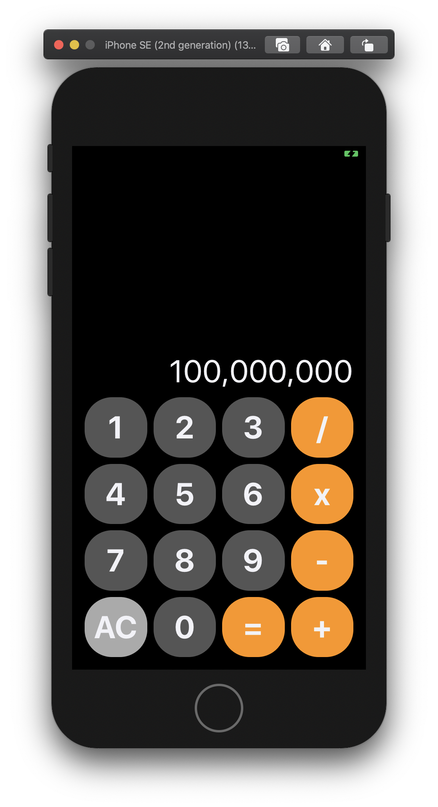
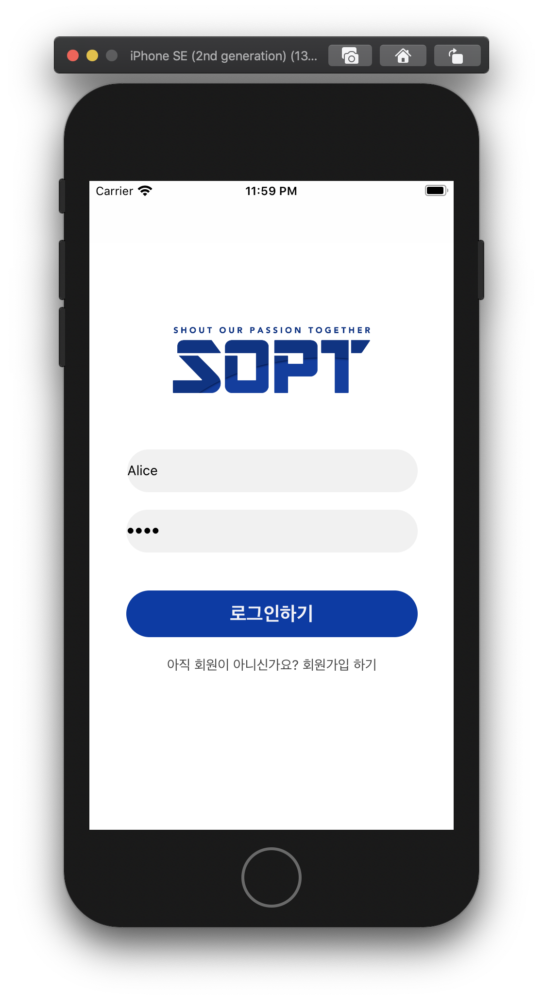
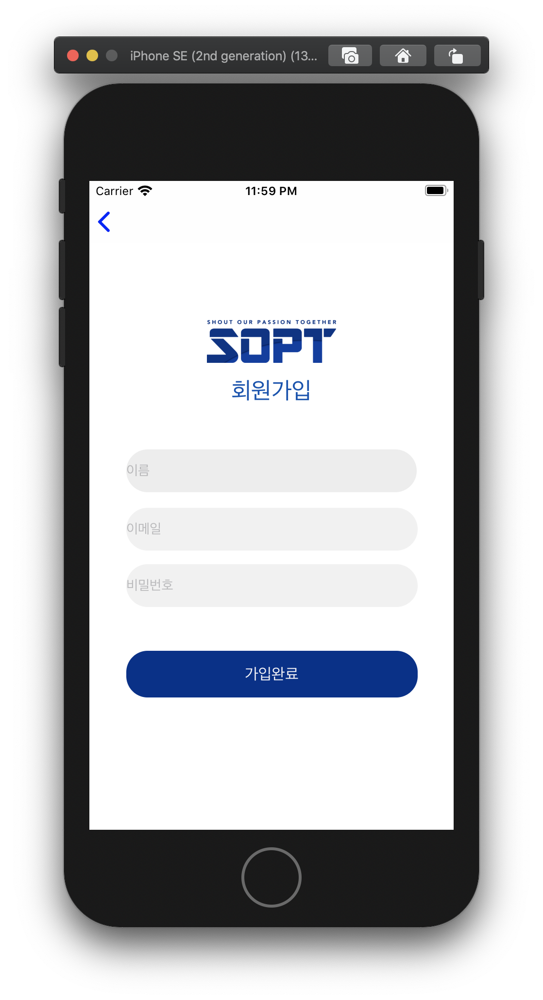
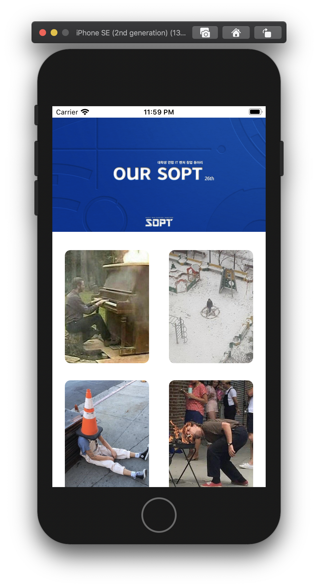
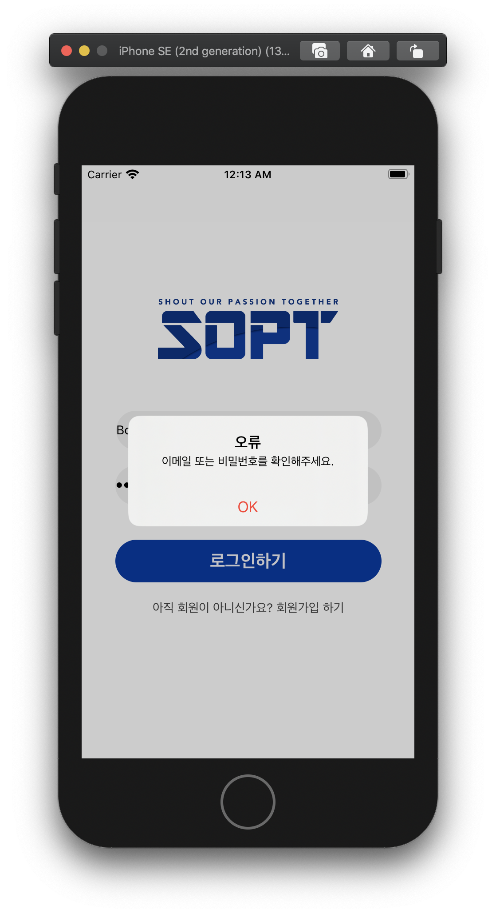

### 2차 과제 01

#### 계산기

기한 ~05.08, 2020

<div>
  
</div>

```swift
//
//  ViewController.swift
//  SecondWeek_Assignment_Calculator
//
//  Created by 양재욱 on 2020/04/28.
//  Copyright © 2020 양재욱. All rights reserved.
//

import UIKit

class ViewController: UIViewController {

    @IBOutlet var btnOne: UIButton!
    @IBOutlet var btnTwo: UIButton!
    @IBOutlet var btnThree: UIButton!
    @IBOutlet var btnDev: UIButton!
    @IBOutlet var btnFour: UIButton!
    @IBOutlet var btnFive: UIButton!
    @IBOutlet var btnSix: UIButton!
    @IBOutlet var btnMul: UIButton!
    @IBOutlet var btnSeven: UIButton!
    @IBOutlet var btnEight: UIButton!
    @IBOutlet var btnNine: UIButton!
    @IBOutlet var btnSub: UIButton!
    @IBOutlet var btnAC: UIButton!
    @IBOutlet var btnZero: UIButton!
    @IBOutlet var btnResult: UIButton!
    @IBOutlet var btnPlus: UIButton!
    
   

    override func viewDidLoad() {
        super.viewDidLoad()
        
        btnOne.layer.cornerRadius = 35
        btnTwo.layer.cornerRadius = 35
        btnThree.layer.cornerRadius = 35
        btnDev.layer.cornerRadius = 35
        btnFour.layer.cornerRadius = 35
        btnFive.layer.cornerRadius = 35
        btnSix.layer.cornerRadius = 35
        btnMul.layer.cornerRadius = 35
        btnSeven.layer.cornerRadius = 35
        btnEight.layer.cornerRadius = 35
        btnNine.layer.cornerRadius = 35
        btnSub.layer.cornerRadius = 35
        btnAC.layer.cornerRadius = 35
        btnZero.layer.cornerRadius = 35
        btnResult.layer.cornerRadius = 35
        btnPlus.layer.cornerRadius = 35
        
    }


}


```


### 2차 과제 02

####  Zeplin + AutoLayout

> 기한 ~05.08, 2020
>
> https://github.com/26th-SOPT-iOS/KimNamSoo
>
> 모르는 부분은 남수형 깃허브를 참고해서 만들었다.

<div>
  
  
  
  
</div>

> UserModel Class를 생성해 login 을 구현했다.

> UserModel.swift

```swift
//
//  UserModel.swift
//  SecondWeek_Assignment_Zeplin_LoginPage
//
//  Created by 양재욱 on 2020/05/05.
//  Copyright © 2020 양재욱. All rights reserved.
//

import Foundation

final class UserModel {
    
    struct User {
        var username: String
        var password: String
    }
    
    var model: [User] = [
       User(username: "Alice", password: "1234"),
       User(username: "Bob", password: "5678"),
       User(username: "Charlie", password: "0101")
    ]
    
    // hasUser 검사 method
    func hasUser(name: String, pwd: String) -> Bool {
        var result = false
        for user in model {
            if user.username == name && user.password == pwd {
                result = true
            }
        }
        return result
    }
        
    // newUser 추가 method
    func addUser(name: String, pwd: String) {
        let newUser = User(username: name, password: pwd)
        model.append(newUser)
    }

}

```


> Login Button Action

```swift
@IBAction func loginAction(_ sender: Any) {
        let alert = UIAlertController(title: "오류", message: "이메일 또는 비밀번호를 확인해주세요.", preferredStyle: UIAlertController.Style.alert)
        let defaultAction = UIAlertAction(title: "OK", style: .destructive, handler : nil)

        // 옵셔널 바인딩 & 예외 처리 : Textfield가 빈문자열이 아니고, nil이 아닐 때
        guard let username = idTextField.text, !username.isEmpty else { return }
        guard let password = pwTextField.text, !password.isEmpty else { return }
        
        // Model이 해당 유저를 가지고 있는지 검사
        let loginSuccess: Bool = userModel.hasUser(name: username, pwd: password)
        if loginSuccess {
            let home = self.storyboard?.instantiateViewController(withIdentifier: "homeViewController")
            self.navigationController?.pushViewController(home!, animated: true)
        }else {
            alert.addAction(defaultAction)
            present(alert, animated: true, completion: nil)
            }
        
    }
```


