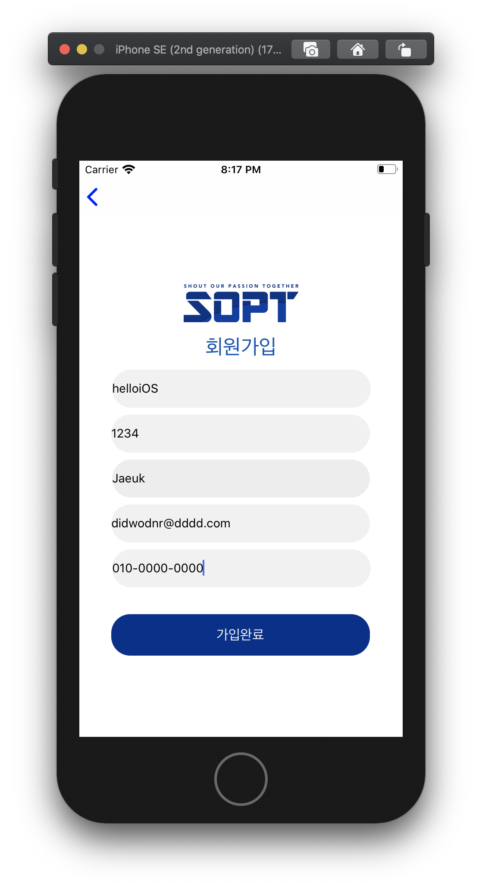
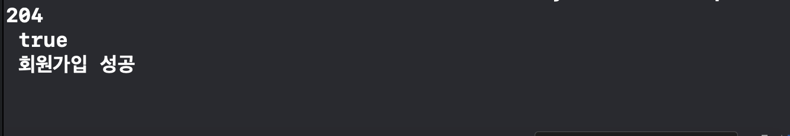
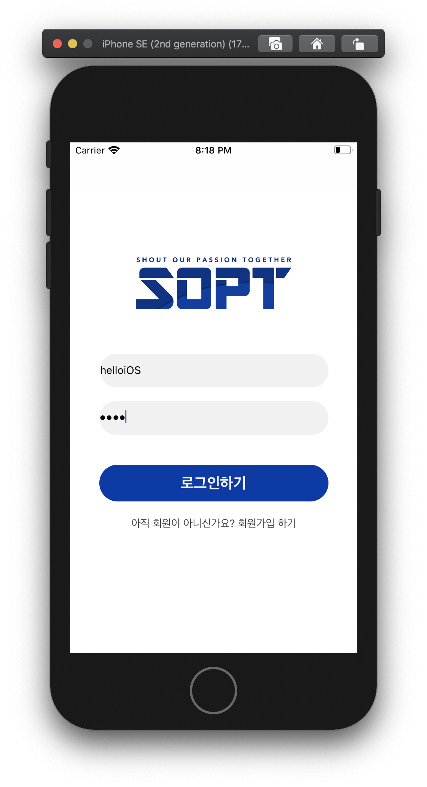
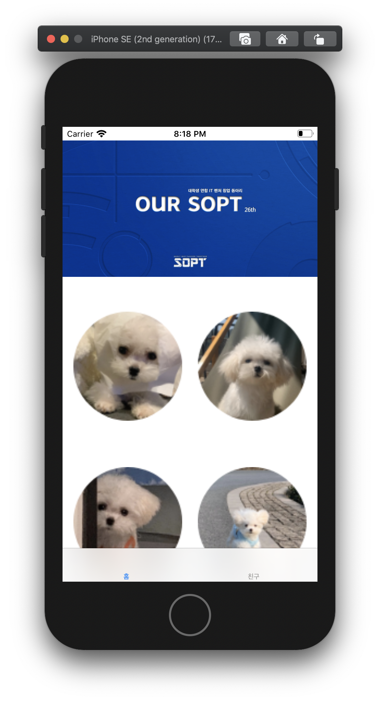
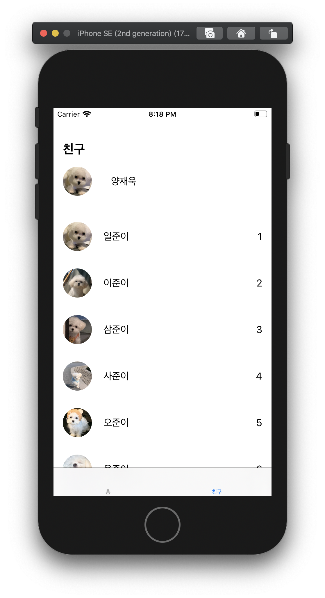

### 2차 과제 01

#### 계산기

기한 ~05.08, 2020

<div>
  
</div>

```swift
//
//  ViewController.swift
//  SecondWeek_Assignment_Calculator
//
//  Created by 양재욱 on 2020/04/28.
//  Copyright © 2020 양재욱. All rights reserved.
//

import UIKit

class ViewController: UIViewController {

    @IBOutlet var btnOne: UIButton!
    @IBOutlet var btnTwo: UIButton!
    @IBOutlet var btnThree: UIButton!
    @IBOutlet var btnDev: UIButton!
    @IBOutlet var btnFour: UIButton!
    @IBOutlet var btnFive: UIButton!
    @IBOutlet var btnSix: UIButton!
    @IBOutlet var btnMul: UIButton!
    @IBOutlet var btnSeven: UIButton!
    @IBOutlet var btnEight: UIButton!
    @IBOutlet var btnNine: UIButton!
    @IBOutlet var btnSub: UIButton!
    @IBOutlet var btnAC: UIButton!
    @IBOutlet var btnZero: UIButton!
    @IBOutlet var btnResult: UIButton!
    @IBOutlet var btnPlus: UIButton!
    
   

    override func viewDidLoad() {
        super.viewDidLoad()
        
        btnOne.layer.cornerRadius = 35
        btnTwo.layer.cornerRadius = 35
        btnThree.layer.cornerRadius = 35
        btnDev.layer.cornerRadius = 35
        btnFour.layer.cornerRadius = 35
        btnFive.layer.cornerRadius = 35
        btnSix.layer.cornerRadius = 35
        btnMul.layer.cornerRadius = 35
        btnSeven.layer.cornerRadius = 35
        btnEight.layer.cornerRadius = 35
        btnNine.layer.cornerRadius = 35
        btnSub.layer.cornerRadius = 35
        btnAC.layer.cornerRadius = 35
        btnZero.layer.cornerRadius = 35
        btnResult.layer.cornerRadius = 35
        btnPlus.layer.cornerRadius = 35
        
    }


}


```


### 2차 과제 02

####  Zeplin + AutoLayout

> 기한 ~05.08, 2020
>
> https://github.com/26th-SOPT-iOS/KimNamSoo
>
> 모르는 부분은 남수형 깃허브를 참고해서 만들었다.

<div>
  
  
  
  
</div>

> UserModel Class를 생성해 login 을 구현했다.

> UserModel.swift

```swift
//
//  UserModel.swift
//  SecondWeek_Assignment_Zeplin_LoginPage
//
//  Created by 양재욱 on 2020/05/05.
//  Copyright © 2020 양재욱. All rights reserved.
//

import Foundation

final class UserModel {
    
    struct User {
        var username: String
        var password: String
    }
    
    var model: [User] = [
       User(username: "Alice", password: "1234"),
       User(username: "Bob", password: "5678"),
       User(username: "Charlie", password: "0101")
    ]
    
    // hasUser 검사 method
    func hasUser(name: String, pwd: String) -> Bool {
        var result = false
        for user in model {
            if user.username == name && user.password == pwd {
                result = true
            }
        }
        return result
    }
        
    // newUser 추가 method
    func addUser(name: String, pwd: String) {
        let newUser = User(username: name, password: pwd)
        model.append(newUser)
    }

}
```


> Login Button Action

```swift
@IBAction func loginAction(_ sender: Any) {
        let alert = UIAlertController(title: "오류", message: "이메일 또는 비밀번호를 확인해주세요.", preferredStyle: UIAlertController.Style.alert)
        let defaultAction = UIAlertAction(title: "OK", style: .destructive, handler : nil)

        // 옵셔널 바인딩 & 예외 처리 : Textfield가 빈문자열이 아니고, nil이 아닐 때
        guard let username = idTextField.text, !username.isEmpty else { return }
        guard let password = pwTextField.text, !password.isEmpty else { return }
        
        // Model이 해당 유저를 가지고 있는지 검사
        let loginSuccess: Bool = userModel.hasUser(name: username, pwd: password)
        if loginSuccess {
            let home = self.storyboard?.instantiateViewController(withIdentifier: "homeViewController")
            self.navigationController?.pushViewController(home!, animated: true)
        }else {
            alert.addAction(defaultAction)
            present(alert, animated: true, completion: nil)
            }
        
    }
```


### 3차 과제

####  Cocoapods, Network, Login, Signup

> 기한 ~05.22, 2020

<div>
  
  
    
  
  
</div>


> SignupData : 토큰이 필요없기 때문에 토큰 삭제
>
> > 받은 데이터를 디코딩해서 저장한다.

```swift
//
//  SignupData.swift
//  SecondWeek_Assignment_Zeplin_LoginPage
//
//  Created by 양재욱 on 2020/05/18.
//  Copyright © 2020 양재욱. All rights reserved.
//

import Foundation

struct SignupData: Codable{
    var status: Int
    var success: Bool
    var message: String
    
    enum CodingKeys: String, CodingKey{
        case status = "status"
        case success = "success"
        case message = "message"
    }
    
    init(from decoder: Decoder) throws{
        let values = try decoder.container(keyedBy: CodingKeys.self)
        status = (try? values.decode(Int.self, forKey: .status)) ?? -1
        success = (try? values.decode(Bool.self, forKey: .success)) ?? false
        message = (try? values.decode(String.self, forKey: .message)) ?? ""
    }
    
}
```


> SignupService
>
> > Alamofire를 사용해서 http통신으로 request를 보내고 response를 받는다.

```swift
//
//  SignupService.swift
//  SecondWeek_Assignment_Zeplin_LoginPage
//
//  Created by 양재욱 on 2020/05/18.
//  Copyright © 2020 양재욱. All rights reserved.
//

import Foundation
import Alamofire

struct SignupService {
    static let shared = SignupService()
    
    private func makeParameter(_ id: String, _ pwd: String, _ name: String, _ email: String, _ phone: String) -> Parameters{
        return ["id": id, "password": pwd, "name": name, "email": email, "phone": phone]
    }

    func signup(id: String, pwd: String, name: String, email: String, phone: String, completion: @escaping (NetworkResult<Any>) -> Void) {
        let header: HTTPHeaders = ["Content-Type": "application/json"]
        let dataRequest = Alamofire.request(APIConstants.signupURL, method: .post, parameters: makeParameter(id, pwd, name, email, phone), encoding: JSONEncoding.default, headers: header)
        // dataResponse = SUCCESS
        // string이 넘어온다.
        dataRequest.responseData { dataResponse in
            switch dataResponse.result {
            case .success:
                guard let statusCode = dataResponse.response?.statusCode else { return }
                guard let value = dataResponse.result.value else { return }
                let networkResult = self.judge(by: statusCode, value)
                completion(networkResult)
            case .failure: completion(.networkFail)
            }
        }
    }
    
    private func judge(by statusCode: Int, _ data: Data) -> NetworkResult<Any> {
        switch statusCode {
        case 200: return isSignup(by: data)
        case 400: return .pathErr
        case 500: return .serverErr default: return .networkFail
        }
    }
    
    private func isSignup(by data: Data) -> NetworkResult<Any> {
        let decoder = JSONDecoder()
        
        guard let decodedData = try? decoder.decode(SignupData.self, from: data) else { return .pathErr }
        // decodedData 값을 print문으로 확인해준다.
        print(decodedData.status, "\n", decodedData.success, "\n", decodedData.message, "\n")
        if decodedData.success{
          	// networkResult를 리턴한다.
            return .success(data)
        }
        else{
            return .requestErr(decodedData.message)
        }
    }
}

```

