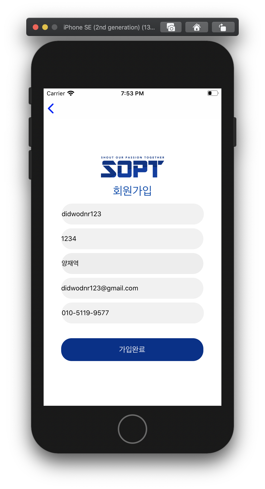
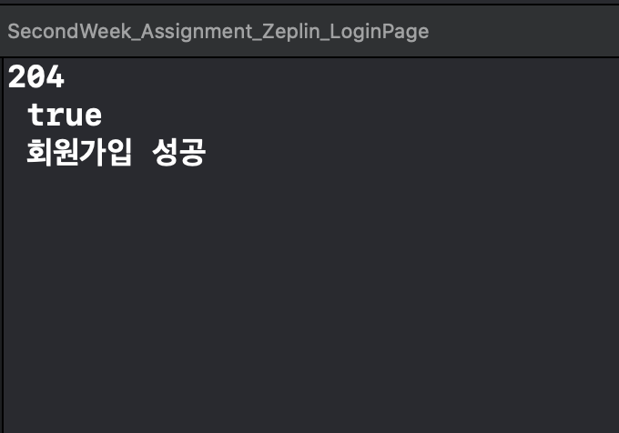

# Week 4 (5/16)

### 세미나 : CocoaPods & Carthage

> **CocoaPods & Carthage**
>
> - ***Cocoapods***: 라이브러리 관리, 라이브러리의 프레임워크 자동 연결.
> - ***Carthage***:  라이브러리만 관리하고 프로젝트와 연결은 개발자가 직접해야 한다.


> **Cocoapods 라이브러리**
>
> - **Alamofire**
>   - HTTP 통신을 위해 스위프트 기반으로 개봘된 비동기 통신 라이브러리
> - **KingFisher**
>   - 웹에서 이미지를 다운로드하고 캐싱하기 위한 라이브러리
>   - 주로 이미지 URL을 실제 이미지로 변환하기 위해 사용


> **JSON (JavaScript Object Notation)**
>
> - 사람이 읽을 수 있는 텍스트 기반의 테이터 교환 표준


> **HTTP 통신을 위한 필수 설정**
>
> > info.plist
> >
> > > Information Property List 
> > >
> > > > App Transport Security Settings


<hr/>

### 세미나 실습 : 로그인 하기

> API 주소 받아오기 > **APIConstants.swift**
>
> - 서버와 협업할 때, API 문서 확인하여 각 Request의 URL 주소 확인

> JSON 타입 Decoding > **SigninData.swift**
>
> - 서버와 통신에서 받는 데이터는 JSON 타입의 형태이다. 이를 iOS에서 사용하기 위해서는 Swift 언어로의 Decode가 필요하다. 각 JSON 타입을 저장할 저장공간 형식을 만들어주어야 한다.

```swift
//
//  SigninData.swift
//  SecondWeek_Assignment_Zeplin_LoginPage
//
//  Created by 양재욱 on 2020/05/18.
//  Copyright © 2020 양재욱. All rights reserved.
//

import Foundation

struct SigninData: Codable{
    var status: Int
    var success: Bool
    var message: String
    var data: TokenData?
    
    enum CodingKeys: String, CodingKey{
        case status = "status"
        case success = "success"
        case message = "message"
        case data = "data"
    }
    // JSON Decoding
    init(from decoder: Decoder) throws{
        let values = try decoder.container(keyedBy: CodingKeys.self)
        status = (try? values.decode(Int.self, forKey: .status)) ?? -1
        success = (try? values.decode(Bool.self, forKey: .success)) ?? false
        message = (try? values.decode(String.self, forKey: .message)) ?? ""
        data = (try? values.decode(TokenData.self, forKey: .data)) ?? nil
    }
    
}
        
struct TokenData: Codable {
    var jwt: String
}
```

> 서버 통신에 따른 결과 > **NetworkResult.swif**t
>
> > 다섯가지의 서버 통신 결과를 리턴한다.

```swift
// 서버 통신 결과 ==> 성공, 요청에러, 경로에러, 서버내부에러, 네트워크연결실패
enum NetworkResult<T> {
  case success(T) 
  case requestErr(T) 
  case pathErr
  case serverErr 
  case networkFail
```

> 로그인 서버 통신 구현 > **LoginService.swift**

```swift
import Foundation
import Alamofire

struct LoginService {
    // 싱글톤 객체로 앱 어디서든 접근 가능
    static let shared = LoginService()
    
    // Request Body에 들어갈 파라미터 생성
    private func makeParameter(_ id: String, _ pwd: String) -> Parameters { return ["id": id, "password": pwd]
    }

    func login(id: String, pwd: String, completion: @escaping (NetworkResult<Any>) -> Void) {
        // Request Header 생성
        let header: HTTPHeaders = ["Content-Type": "application/json"]
        // 원하는 형식의 HTTP Request 생성
        let dataRequest = Alamofire.request(APIConstants.signinURL, method: .post, 	parameters: makeParameter(id, pwd), encoding:
            JSONEncoding.default, headers: header)
        // 데이터 통신 시작
        dataRequest.responseData { dataResponse in
            switch dataResponse.result {
            case .success:
                guard let statusCode = dataResponse.response?.statusCode else { return }
                guard let value = dataResponse.result.value else { return }
                let networkResult = self.judge(by: statusCode, value)
                completion(networkResult)
            case .failure: completion(.networkFail)
            } }
    }
    
    // statusCode에 따라 분기 실행
    private func judge(by statusCode: Int, _ data: Data) -> NetworkResult<Any> {
        switch statusCode {
        case 200: return isUser(by: data) //Request 성공
        case 400: return .pathErr					//Request가 에러로 실패한 경우, 보통 개발자의 잘못
        case 500: return .serverErr				//서버 내부의 오류가 있을 경우
        default: return .networkFail }
    }
    
    // 최종적으로 데이터 통신에 성공한 경우, JSON 타입 Decoding을 실행 후, 값을 확인한다
    private func isUser(by data: Data) -> NetworkResult<Any> {
        let decoder = JSONDecoder()
        guard let decodedData = try?
            decoder.decode(SigininData.self, from: data)
            else { return .pathErr }
        guard let tokenData = decodedData.data
            else { return .requestErr(decodedData.message) }
        return .success(tokenData.jwt)
    } }
```

> **싱글톤 패턴**
>
> > Singleton Pattern은 객체를 하나만 생성하여, 생성된 객체를 **어디서든 참조할 수 있도록 하는 패턴**이다.

>  로그인 데이터 받아오기 -> **ViewController.swift**

```swift
@IBAction func login(_ sender: Any) {
        guard let inputID = enterID.text else { return }
        guard let inputPWD = enterPW.text else { return }
        
        // 미리 정의해 둔 싱글톤 객체 통해 데이터 통신
        LoginService.shared.login(id: inputID, pwd: inputPWD) { networkResult in
            switch networkResult {
            // 데이터 통신이 성공한 경우
            case .success(let token):
                guard let token = token as? String else { return }
                UserDefaults.standard.set(token, forKey: "token")
                guard let tabbarController = self.storyboard?.instantiateViewController(identifier: "customTabbarController") as? UITabBarController else { return }
                tabbarController.modalPresentationStyle = .fullScreen
                self.present(tabbarController, animated: true, completion: nil) 
              // 데이터 통신은 성공했지만 유저의 실수로 로그인 실패가 된 경우
              case .requestErr(let message):
                    guard let message = message as? String else { return }
                    let alertViewController = UIAlertController(title: "로그인 실패", message: message, preferredStyle: .alert)
                    let action = UIAlertAction(title: "확인", style: .cancel, handler: nil)
                    alertViewController.addAction(action)
                    self.present(alertViewController, animated: true, completion: nil)
            case .pathErr: print("path")
            case .serverErr: print("serverErr") case .networkFail: print("networkFail") }
        }
    }

```

<hr>

### 과제 : 회원가입

> **회원가입 하기** ( 서버 사용 )

<div>
 
 
</div>